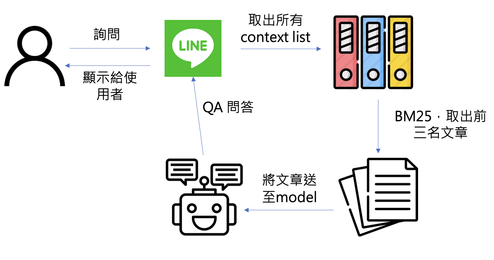

# ai-bert-question-answer
Bert 問答任務

檔案階層
---
```
ai-bert-question-answer
│   README.md
|
└───data_export
│   │   split_data.py
│   │   jimmy_train.xlsx
|   |   hcp_train.json
|   |   hcp_test.json
│   
└───training
|   │   useHPVModel_0922.ipynb
|
└───chatbot
    │   context_list.py
    │   demo.py
    |   dict.txt.big
    |   lineBot.py
    │   preprocess.py
    │   requirements.txt
    |   stopword.txt
    |   Dockerfile
    └───model
        │   jimmy_QA_config_file.bin
        │   jimmy_QA_model.bin
        |   vocab.txt      
```

目錄介紹
---
### data_export
* 使用方式:
```
>> python split_data.py --help
usage: split_data.py [-h] --path PATH [--prefix PREFIX] [--test_size TEST_SIZE]

Devide data into train data and test data

optional arguments:
  -h, --help            show this help message and exit
  --path PATH           The path of xlsx data
  --prefix PREFIX       Prefix string in train data name and test data name
  --test_size TEST_SIZE
                        This parameter is same as sklearn's parameter. Its type should be float so far
```
* split_data.py主要將 xlsx 分為 train data 與 test data，參數 '--path' 輸入xlsx的路徑，'--prefix' 為json檔的前綴詞，預設為'hcp'，'test_size'輸入train與test的比例，為浮點數


### training

* useHPVModel_0922.ipynb 尚未整理，需與'讀取data'那段改成由 `./data_export/split_data.py` 輸出的train data 與 test data的json file
* 可與 'train' 那段可自行修改 model 名字

### chatbot

* chatbot目前流程圖


* 執行方式:
```
>> cd your_path/ai-bert-question-answer/chatbot
>> python lineBot.py
```
* 如何用串接line
    * 先於[此網址](https://drive.google.com/drive/folders/1PFS1_ugnHIWSDgHsrvppSzLwOmCdVgfg?usp=sharing) 將model目錄載下來後放置於chatbot目錄下，並改名為'model'
    * Step1. 於[Line developers](https://developers.line.biz/zh-hant/)建立一個message api channel
    * Step2. 下載 [ngrok](https://ngrok.com/download)，於terminal 執行，將https那段url複製:
    ```
    >> your_path/ngrok http 8080
    ```
    * Step3. 將 Step2 的 url 貼上 webhook url
    * Step4. 掃 QR code 可以開始聊天


TODO
---
1. 部署至gcp
2. training/useHPVModel_0922.ipynb 整理成py檔
3. chatbot `README.md` 補充